# Naval Battle Project Report
_Element 011: COURSEWORK (2000 WORDS) (2020 MOD004883 TRI1 F01CHE) Component 2_
_Author: Pedro Pires, SID: 1715958_

# 1. Preface

My name is Pedro, I am a havid programmer and game jammer. I am also a student
of Software Development in the UK. This project might seem a little simple to 
the simple OOP developer. But, for academic purposes, I will expand my playing
field and knowledge of Java by following the most obscure programming method,
ECS. I will also be programming everything from scratch since this assigment's
learning outcomes (which can be read bellow) requires me to achieve a high 
standard of quality.

> _"Design, develop and evaluate a program applying ‘best practice’ that meets 
> the requirements of a given scenario and achieve an acceptable high standard
> of quality."_ - Assigment Description/Learning Outcome 3

Fortunately for you (the reader) I have made the project and you wont have to
write a single piece of code while I explain in detail the development of this
simple game. From software-rendering and ECS to completed game, this was a 
journey for me. Specially in Java 8. So sit back, relax and prepare some tea.

# 2. Introduction

Battleship is a classic board game of guessing and strategy for two players.
Each player possesses a ruled grid on a board on which the player's fleet of
ships are marked. At the begining of the game, each player marks the position
of their fleet's ships on the grid and then proceeds to guess with "missiles"
the position of the other player's ships. To win, the player must sink the 
opponent's fleet, which means guessing the right positions of the ships of
the opponent's fleet.

Naval Battle is a Java-based version of this game, using Java's standard
libraries and software-rendering to play the game against a computer. This
report, goes through the development process of the project, documentation and
testing done to make sure the game is a 1 to 1 recreation of the classic board
game.

# 3. Table of Contents

- [Naval Battle Project Report](#naval-battle-project-report)
- [1. Preface](#1-preface)
- [2. Introduction](#2-introduction)
- [3. Table of Contents](#3-table-of-contents)
- [4. Naming Conventions Used](#4-naming-conventions-used)
- [5. Abstract](#5-abstract)
- [6. Development Plan](#6-development-plan)
- [5. Problems and Systems](#5-problems-and-systems)
  - [5.1 ECS](#51-ecs)
    - [5.1.1 The `GameContainer`](#511-the-gamecontainer)
      - [5.1.1.1 Game Systems Initialization](#5111-game-systems-initialization)
      - [5.1.1.2 Update Cycle](#5112-update-cycle)
      - [5.1.1.3 Draw Cycle](#5113-draw-cycle)
    - [5.1.2 Creating an Entity with Components](#512-creating-an-entity-with-components)
    - [5.1.3 Creating Systems](#513-creating-systems)
    - [5.1.4 The Default Render System](#514-the-default-render-system)
    - [5.1.5 Core Systems](#515-core-systems)
- [6. Future Improvements](#6-future-improvements)
  - [6.1 Component Register](#61-component-register)
  - [6.2 Content Loader](#62-content-loader)
  - [6.3 Computer AI](#63-computer-ai)
  - [6.4 Quality of Life](#64-quality-of-life)
- [7. Screenshots](#7-screenshots)
- [8. Testing](#8-testing)
- [9. Conclusion](#9-conclusion)
- [10. References](#10-references)
- [11. Thanks](#11-thanks)
- [12. Appendix](#12-appendix)

# 4. Naming Conventions Used

_Italic_ are meant to refer to books, videos or other references. These can be
accessed for further research in the [References](#references) section.

**Bold** are meant to refer to Classes, Objects and Variables.

`Inline Blocks` are meant to refer to Code.

```java
//Code Blocks
```
are meant to refer to blocks of code.


> Block Quotes 
are meant to refer to extra notes when writing this project report by me

> _"Quoted Italics Block Quotes"_

are meant to refer to text, maybe written in books, articles or this 
assigment's description. Usually followed by where the quote can be found

# 5. Abstract

In this Document, various topics will be talked about in regards of the Naval
Battle project but mainly we will talk about the Development Plan, the Problems
I encountered and the systems and algorithms I would end up building.

# 6. Development Plan

Initialy the idea was simple, to make a Swing/AWT application with simple
buttons and colours to represent the grid. That plan was flushed down instantly
since the idea of making software rendering in java was both more interesting 
considering the academic learning and more frustrating considering there would
be no external libraries.

So the first part was research. Youtube videos (
_Java Game Engine Youtube Playlist_ was specially informative), a couple of 
books (_Practical Game Design_, a little bit of 
_Real-Time 3D Graphics with WebGL 2_ and a sprinkle of
_Learn Java the Easy Way_). In this research I learnt 2 things:

- Java 8 is old, since I wanted to use the JavaFX library but it's not good on
  Java 8
- Java is going to be frustrating
- I needed to work towards performance optimization since I was
  software-rendering

With this information I decided to procceed with the project anyways for 
academic purposes of course.

Then I opted for a Waterfall-type development cycle described in 
_Practical Game Design Chapter 1_. So I proceeded to make a list of tasks to
complete for a complete product:

- Internal Engine
  - Window Renderer
  - Texture Loader
  - Entity Component System (ECS)
  - Input Handler
  - Cursor System
  - Default Renderer
- Actual Game
  - Grid Components
  - Computer AI
  - UI

So I proceeded to making the Internal Engine.

# 5. Problems and Systems

## 5.1 ECS

As a progammer, I had some experience with ECS in other languages, mainly C#
and C++, so I was already prepared for Java since it is a C-based language.

So the first files to create would be the interfaces for all the **Entities**,
**Components** and **Systems**. These were named **IEntity**, **IComponent** 
and  **ISystem** respectively.

The purpose of the **Entity Component System** is efficiency. Unlike EC or 
other class-based object-oriented, the **Entity** and **Components** only have
data for **System**s to act and modify.

The **Components** and the **Entities** live in different lists in the program,
the **EntityManager** and the **ComponentRegister** lists respectively. The 
following UML diagrams show the methods and properties of these 2 classes. 

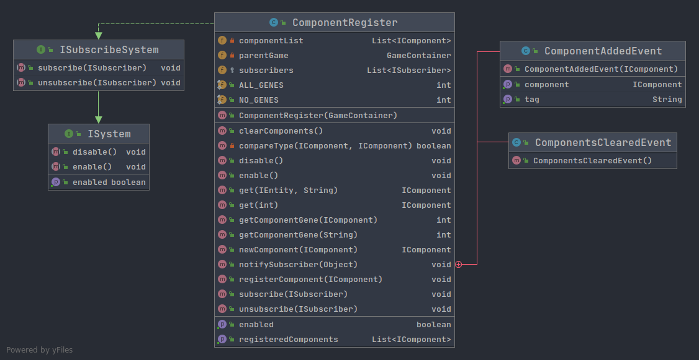 
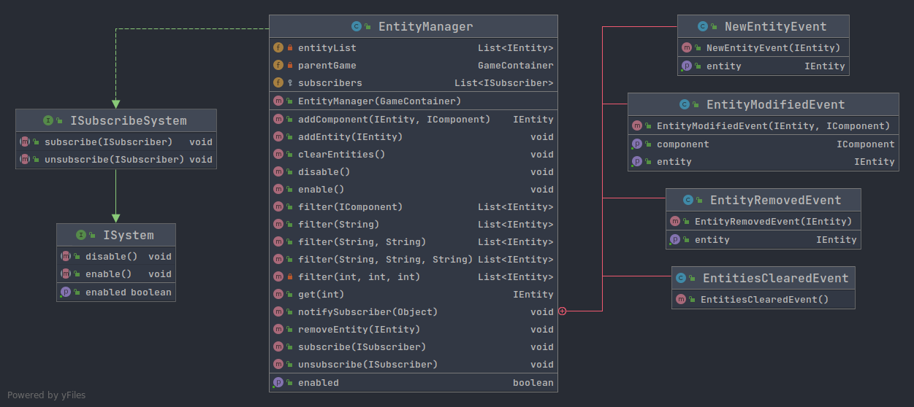

Initially, skiming through these UML diagrams, a regular Object-Oriented 
Programmer would have about 3 headaches, 2 seizures and around 5-7 hours of 
physcological recovery. Lucky for you (the reader) I am here to explain the 
purpose and function of these systems in the ECS ecosystem.

### 5.1.1 The `GameContainer`

The **GameContainer** is the programmer's main class to create their game using
this internal engine.

This class implements the **Runnable**, which for the unknowing programmer is 
Java's way of implementing Multi Threading into their JVM. When the programmer 
wants to create their own game with the internal engine they need to extend the
**GameContainer** class

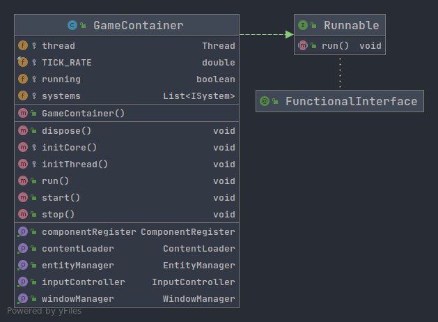

The **GameContainer**'s methods are called in the following order:

1. `start()`
2. `run()`
3. `stop()`
4. `dispose()`

To start up the game, the programmer must write a `main` method that creates an
instance of their **GameContainer** and calls the `start()` method. This method 
will start the **Thread** starting the game's Update and Draw loops as well as 
initialize the **IInitSystems** 
(explained in [Creating Systems](#creating-systems)).

The `TICK_RATE` at the top of the **GameContainer**'s limits the amount of 
update cycles and draw cycles of the **Thread** since having no `TICK_RATE`
would use 100% of the CPU instead of just sometimes using the CPU. This is 
something I learnt from the _Java Game Engine Youtube Playlist_.

The actual `run()` method has 3 purposes:

- Initialize the **IInitSystems**
- Update the **IUpdateSystems**
- Draw the **IDrawSystems**

#### 5.1.1.1 Game Systems Initialization

First the **Thread** goes through each system added and calls the `Init()` 
method. The way this works with the System types is explained further in 
[Creating Systems](#creating-systems) but for now just imagine there is a list
of systems in the **GameContainer**.

```java
// inside the run() method...
for (int i = 0; i < systems.size(); i++) {
    ISystem system = systems.get(i);
    if (system instanceof IInitSystem){
        ((IInitSystem) system).Init();
    }
}
```

Then it initializes the variables required to keep the Update and Draw cycles
on track with the `TICK_RATE`.

```java
//...after system initialization...
double currentTime = 0;
double lastUpdateTime = System.currentTimeMillis();
double gameTime = 0;
double unprocessedTime = 0;

boolean requireRender = false;
//...while cycles...
```

`currentTime` is used in the loop to determine how many milliseconds have 
passed since the `lastUpdateTime`. The difference between these is added to the
`unprocessedTime` variable and is also saved in the `gameTime` variable. The 
`requireRender` is used to determine if the Draw cycle should be performed.

#### 5.1.1.2 Update Cycle

The update cycle is where the magic happens. The time elapsed between the 
current loop and the last loop is calculated from the `currentTime` and
`lastUpdateTime` variables respectively and then put into the `gameTime`
variable. Then the `gameTime` is added to the `unprocessedTime`. If the 
`unprocessedTime` is bigger than the `TICK_RATE` then the `Update()`
methods of the systems are called.

```java
// ...inside thread while loop
currentTime = System.currentTimeMillis();
gameTime = currentTime - lastUpdateTime;
lastUpdateTime = currentTime;

unprocessedTime += gameTime;

while (unprocessedTime >= TICK_RATE){
    unprocessedTime = 0;
    for (int i = 0; i < systems.size(); i++) {
        ISystem system = systems.get(i);
        if (system.isEnabled()) {
            if (system instanceof IUpdateSystem) {
                ((IUpdateSystem) system).Update(gameTime);
            }
        }
    }
    requireRender = true;
}
// Draw loop...
```

After all the updates are completed the `requireRender` variable is set to true
and that leads us to the...

#### 5.1.1.3 Draw Cycle

At the end of the Thread while loop resides our Draw Cycle. This cycle only 
happens if the Update cycle was finished and set the `requireRender` variable
to true.

In this cycle, each Draw System's `Draw()` method is called and the window is 
finally rendered with the output of our Draw Systems.

```java
// after Update loop but inside the Thread loop
if (requireRender){
    for (int i = 0; i < systems.size(); i++) {
        ISystem system = systems.get(i);
        if (system.isEnabled()) {
            if (system instanceof IDrawSystem) {
                ((IDrawSystem) system).Draw();
            }
        }
    }
    WindowManager.drawWindow();
    requireRender = false;
}
// end of the Thread loop
```


### 5.1.2 Creating an Entity with Components

When creating the game, the programmer needs to create Components that 
implement the **IComponent** interface then register them to the 
**ComponentRegister** using the `registerComponent()` method. This will add
that component to the `registeredComponents` list and therefore assigning an
index to this component type.

Then the programmer needs to create an **Entity** instance and add it to the
**EntityManager**. This entity will harbour the index of the components of this
entity from the **ComponentRegister**.

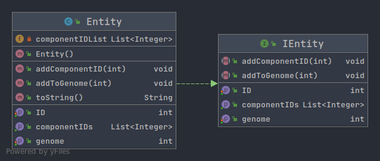

To create Components and add them to the Entity's component list, the
programmer must create the components using the **ComponentRegister**'s
`IComponent newComponent(new IComponent())` method which will return a Component
instance of the class  given in the parameter. Then the programmer must use the
**EntityManager**'s `addComponent(entityInstance, componentInstance)` to add 
the component to the **Entity**'s component list.

At this point all the programmer has is an **Entity** instance comprised of the 
**Components** added. The **EntityManager**'s `addEntity(entityInstance)` 
method can then be used to finally add it to the `entityList`.

### 5.1.3 Creating Systems

Systems to act on these Entities are quite rather simple to create, but first
we must understand the various types of systems that can be created.

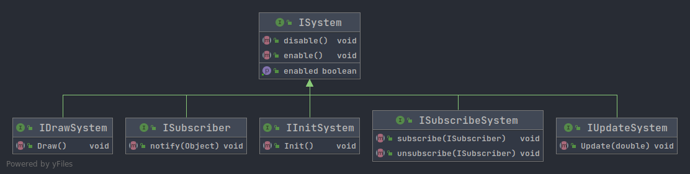

- **IInitSystem** 
  - Systems that need initialization. Will be called first in the Thread.
- **IUpdateSystem**
  - Systems that act during the Update Cycle, which should do all calculations 
  necessary for the other systems. First to be called in the Thread Cycle.
- **IDrawSystem**
  - Systems that act during the Draw Cycle, typically just process and send 
  frame pixel data to the WindowManager. No heavy calculations should happen
  in here. Last to be called in the Thread Cycle.
- **ISubscriber**
  - Systems that listen to **Events** from other systems. Typically these only
  act once in a while or are attached to other system types to update variables
  in Update or Draw systems.
- **ISubscribeSystem**
  - Systems that notify **ISubcriber**'s of **Events** that happen in this type
  of system

So imagine a system you want to create... Now let's imagine a simple system
that moves Entities to the left on every update if they have a 
**PositionComponent**. The system in question is clearly an **IUpdateSystem**
but lets see how the process would go.

First the system implements the **IUpdateSystem** interface so it can be found
by the Update Cycle when updating. This means it must implement the 
`Update(double elapsedTime)` method. In here we can have our code to move the 
Entities around.

```java
public class MoveLeftSystem implements IUpdateSystem {
  // Create the system's variables
  // The parentGame contains the EntityManager and the ComponentRegister
  private GameContainer parentgame;
  // The list of entities that have a PositionComponent
  private List<IEntity> moveEntityList;

  // Constuctor of this system
  public MoveLeftSystem (GameContainer gameContainer) {
    // Initialize the variables
    parentGame = gameContainer;
    moveEntityList = new ArrayList<IEntity>();
  }

  // Update method
  public void Update(double elapsedTime) {
    for (IEntity entity : moveEntityList) {
      // ????????????
    }
  }
}
```

Here we already see a problem with our system. How are we going to retrieve 
only the entities that have a **PositionComponent**? Fortunate for you, I spent
hours perfecting the **EntityManager** so that you could use the following 
method:

```java
moveEntityList = parentGame.getEntityManager().filter("position_component");
```

This method retrieves a **ArrayList\<IEntity\>** and is somewhat efficient with
but if called every `Update()` it could cause serious performance issues. So 
in order to only update this list only when needed, this **IUpdateSystem** must 
also become an **ISubscriber**. The **EntityManager** has the following events:

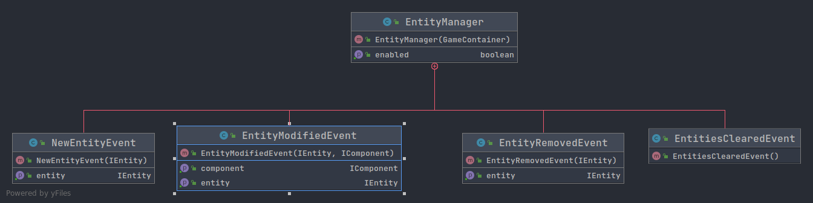

As an **ISubscriber** we can listen to all these events to update our 
moveEntityList like this:

```java
public class MoveLeftSystem implements IUpdateSystem, ISubscriber {
  // Rest of the code from the other code block
  public void notify(Object data) {
        if (
          data instanceof EntityManager.EntityModifiedEvent || 
          data instanceof EntityManager.EntitiesClearedEvent || 
          data instanceof EntityManager.EntityRemovedEvent) 
        {
          moveEntityList = parentGame.getEntityManager().filter("position_component");
        }
    }
}
```

> This code might seem like a big block in our system, but it actually saves 
> precious time between all the other **IUpdateSystem**s.

So with our filter being updated every time it needs, we can finally move 
Entities with a **PositionComponent** to the left on our Update method. This 
is pretty simple because I also spent hours to make the method to retrieve
the **PositionComponent** from the **ComponentRegister** called `get(IEntity entityInstance, String componentTag)`.

```java
public class MoveLeftSystem implements IUpdateSystem, ISubscriber {
  // Properties and Constructor...

  // Update method
  public void Update(double elapsedTime) {
    for (IEntity entity : moveEntityList) {
      // Retrieve the component
      PositionComponent position = parentGame.getComponentRegister().get(entity, "position_component");
      // Get the current horizontal position
      float currentX = position.getX();
      // Alter that position
      position.setX(currentX - 1);
    }
  }
}
```

This will make it so that the Entity will move to the left but we first have to
add this System to the **GameContainer** in the `start()` method. Something 
like this:

```java
MoveLeftSystem moveLeftSystem = new MoveLeftSystem(this);
systems.add(moveLeftSystem);
```

This initially wont work since we haven't subscribed it to the 
**EntityManager** so the **Entity** filter is never updated. To subscribe all
you need to do is use the `subscribe(ISubscriber subscriberInstance)` method 
with our new system to the **EntityManager**. So the code will actually look 
something like this:

```java
// Create an instance
MoveLeftSystem moveLeftSystem = new MoveLeftSystem(this);
// Subscribe (to get notified of Entity Events)
EntityManager.subscribe(moveLeftSystem);
// Add to the system list (to get updated)
systems.add(moveLeftSystem);
```

That's it! That's our first system.

There's actually 4 systems in the Naval Battle project, but more default 
systems in the Internal Engine. Here's the systems in the project:

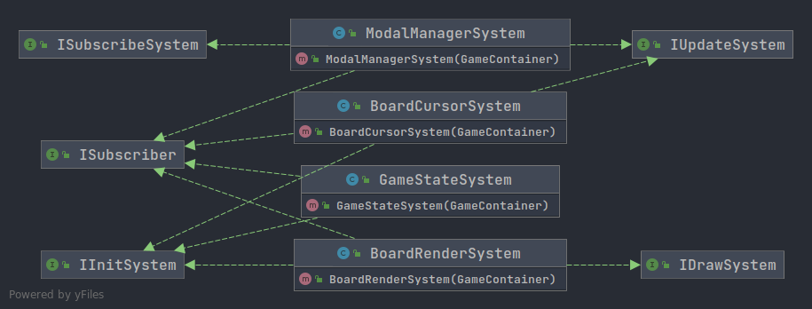

- **BoardCursorSystem** : `IUpdateSystem`, `IInitSystem`, `ISubscriber`
  - Manages the cursor and its drawable entity.
- **BoardRenderSystem** : `IDrawSystem`, `IInitSystem`, `ISubscriber`
  - Renders the background and the Entities with **GridComponents**, as well as
  modals.
- **ModalManagerSystem** : `IUpdateSystem`, `ISubscribeSystem`, `ISubscriber`
  - Updates modal positions (the tutorial pop-ups), listens for new ones added
  and notifies subscribers if a modal was dismissed.
- **GameStateSystem** : `IInitSystem`, `ISubscriber`
  - Waits for user mouse clicks, manages the boards, harbours the CPU robot and
  the state of the game.

### 5.1.4 The Default Render System

This system was the most painful, frustrating system to complete. It had 
everything a programmer could hate, variables. Unfortunately for me, Java 8's
inbuilt **BufferImage** class can only be changed pixel by pixel so the 
**DefaultRenderSystem** works like an old CRT monitor (if you're too young 
you should look up what they look like, big boxes!) scanning over every line of
pixels and modifying each one. 

Fortunately for you I spent another great amount of time making the process 
easy for anyone to draw images or text from the gfx package of the Internal 
Engine. But first let's go over a bit on how it works.

```java
public class DefaultRenderSystem implements IInitSystem, IDrawSystem, ISubscriber {
    // Pixel Width and Height are the size of the Frame in pixels
    private int pixelWidth, pixelHeight;
    // Pixel data is an Array with each colour of each pixel in the frame
    private int[] pixelData;

    // ...initialization, construction...

    private void setPixelAt(int x, int y, int argb){
        // Since the pixelData variable is an array, the index 
        // of the x and y pixel needs to be calculated using 
        // precise algebra
        int actualPosition = x + y * pixelWidth;
        
        // This checks if the pixel to be drawn is out of bounds
        if (x < 0) return;
        if (y < 0) return;
        if (x > pixelWidth - 1) return;
        if (y > pixelHeight - 1) return;

        // setAlpha is the transparency of the colour in argb
        int setAlpha;
        // Then we check again
        if (actualPosition <= pixelData.length - 1 && actualPosition >= 0) {
            // Blending of transparency
            /* 
            To obtain this value we must think of the colour 
            as a 32 bit number  like so: -1
            The integer "-1" is actually full white because of
            how integers are saved in memory. They are saved 
            as a binary number like:
            11111111  11111111  11111111  11111111
            |------|  |------|  |------|  |------|
             alpha      red      green      blue

            Full white is -1 because the left-most bit decides
            if the number is negative. But that doesn't matter
            right now. What matters is how we obtain the alpha
            value.

            Considering that the alpha is on the position
            described above, it would be 24 bits from the 
            right-most bit therefore we must shift those bits
            to the right therefore obtaining only the alpha
            bits as a whole number

            11111111  11111111  11111111  11111111
            |------|  |-------------------------->
             alpha              24 bits

            00000000  00000000  00000000  11111111  
            |-------------------------->  |------|  
                       24 bits             alpha 
            */ 
            setAlpha = (rgba >> 24) & 0xff;
            // This switch statement is to decide if the pixel 
            // is transparent
            switch (setAlpha) {
                // FULL TRANSPARENT
                case 0:
                    // Since the pixel is fully transparent,
                    // don't draw it
                    break;
                // FULL OPAQUE
                case 255:
                    // Since the pixel is opaque, draw it
                    pixelData[actualPosition] = rgba;
                    break;
                // Any other case
                default:
                    // This is for dithering
                    // If a int is divisible by 2 then its 
                    // rightmost bit will be 0 after a right 
                    // bitshift
                    int pixelIndex = (x+y);
                    if ((pixelIndex & ((1 << 1) - 1)) == 0)
                        pixelData[actualPosition] = rgba;
            }
        }
    }

    // other methods and bullshitery...
}
```

> This is one of my proudest methods since it utilizes bit manipulation 
> beautifully to cost less performance and frame times.

Now that you could peak into the hours I spent with this method, you can use 
the much easier to use `drawImage(Image image, int x, int y)` and 
`drawText(String text, SpriteFont spriteFont, int x, int y)` methods which just
call the `setPixelAt` method in their process.

Let's also dive into the drawImage method:

```java
public class DefaultRenderSystem implements IInitSystem, IDrawSystem, ISubscriber {
    // Pixel Width and Height are the size of the Frame in 
    // pixels
    private int pixelWidth, pixelHeight;
    // Pixel data is an Array with each colour of each pixel
    // in the frame
    private int[] pixelData;

    // ...initialization, construction...

    private void drawImage(Image image, int x, int y){
        // This checks if the image is within bounds, if not 
        // don't draw it
        if (x > pixelWidth) return;
        if (image.getWidth() + x < 0) return;
        if (y > pixelHeight) return;
        if (image.getHeight() + y < 0) return;

        // This retrieves the Image's pixel data array
        int[] imageData = image.getPixelData();

        // Ieterate each pixel in the array and draw it on 
        // its respective x and y positions
        for (int pixelDataX = 0; pixelDataX < image.getWidth(); pixelDataX++) {
            for (int pixelDataY = 0; pixelDataY < image.getHeight(); pixelDataY++) {
                // Get the data of that pixel
                int rgbData = imageData[pixelDataX + (pixelDataY * image.getWidth())];
                // Draw it
                setPixelAt(pixelDataX + x, pixelDataY + y, rgbData);
            }
        }
    }

    // other methods and mental stability...
}
```

> Super duper simple for you! Hours of debugging for me!

### 5.1.5 Core Systems

Core Systems are the systems inbuilt into the Internal Engine. These underlying
systems are initialized before the systems mentioned in the section above and
take care of the main functions of the Internal Engine: Managing the Window, 
Loading Asset files, Processing User Input, Managing Entities and Managing
Components.

The last two Systems you have already heard, the **EntityManager** and the
**ComponentRegister**. Like most of the other systems, they are 
**ISubscribeSystem**s meaning they notify **ISubscriber** systems of events 
that happen in the Core Systems.

Following is a diagram with the current events in each of the Core Systems.

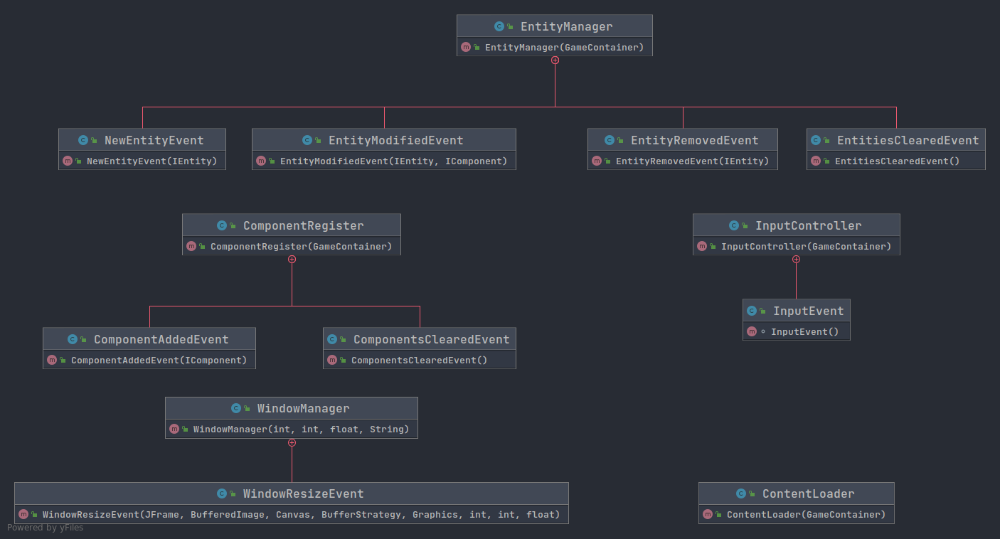

For example, the **WindowManager** creates an **WindowResizedEvent** every time
the window size is changed programatically (doesn't yet support user resizing 
the window) and notifies its Subscribers of the event. One of these is the 
inbuilt **DefaultRenderSystem** which listens for this event as to keep the 
aspect ratio of the frame.

> The **BoardRenderSystem** actually extends the **DefaultRenderSystem** so
> this method is inherited.

The **InputController** actually implements different interfaces from Java 8's
standard library: **KeyListener**, **MouseListener** and 
**MouseMotionListener**. This means that all the **InputController** does is 
map the various clicks, presses and movement into its more managable 
**InputEvent**.

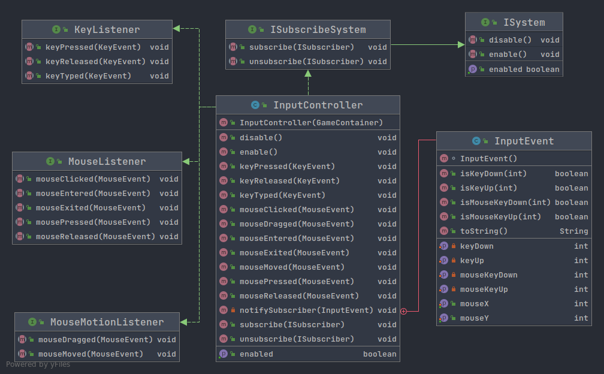

This is also so that the **GameContainer** and its systems
don't have to do the extra work of listening to clicks, presses and movement
of the user on the window. Instead they just subscribe to this System and 
wait for an **InputEvent**.

> If I didn't have a system like this the code would be much more 
> overencumbered since each system would have to implement **KeyListener**'s,
> **MouseListener**'s and **MouseMotionListener**'s methods! Such a bother it
> would have been.

**ContentLoader** is the only system that doesn't have any attribuited events
(for now) since it only keeps textures, spritesheets and fonts. For the 
relevant Systems, these textures can be imported with the `getTexture(int ID)` 
method.

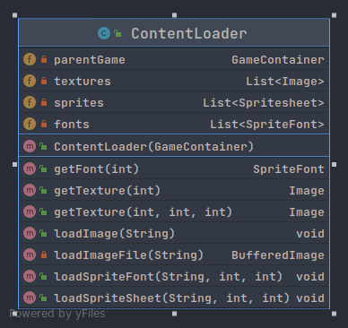

The the `loadWhatever` methods of the **ContentLoader** can be used to load
assets into the program to then be retrieved later by the `getWhatever` 
methods.

# 6. Future Improvements

There's a couple improvements that could be done to the Internal Engine and the
game overall. This section will go into some of these improvements.

## 6.1 Component Register

The **ComponentRegister** has inbuilt methods to identify if Entities have 
a specific component type using my own inovative technology "Binary Genome".

Basically, when a component is registered, an index is given to that component
type. Then whenever a component is added to an entity, that index determines
what **bit** to set on the genome of that entity.

> This works by bit manipulation, bitshifting a 1 x amount of times into the
> **Entity**'s genome, where the x is the index of the registered component.
> For a Object Oriented Programmer, you might have never heard of bit 
> manipulation. I recomend searching for it on Wikipedia or searching for 
> "bit manipulation calculator" to try it out yourself.

This "Binary Genome" can then be used to compare two Entities or to filter
Entities with same components.

The **Component Register** right now, uses String comparisons to compare 2 
different Components of the same type (or different types). This is really 
inefficient but I thought my instructors would have an easier time 
understanding this type of comparison rather than my own "Binary Genome"
technology.

> Computers are million lightyears faster making binary calculations than 
> making String comparisons and I don't need a reference for this.

## 6.2 Content Loader

There could be many more asset load methods, for sounds, animated sprites,
visual effects, particles, etc... but that would not fit such a simple project.
But something that would fit more would be some events for asset loading. This
would be benificial for bigger projects since it would make loading screens
possible.

Another idea for the **ContentLoader** would be maybe serialization of files
to load on project building. By this I mean the **ContentLoader** could have
a command line utility to transform all the files from their regular format
into a format that can be read faster by the computer, a format that could be
deserialized directly into a instance of a class like the **Image** class.
This would only be benificial again in bigger projects.

## 6.3 Computer AI

The current algorithm for the computer to guess the position of the boats is
mostly based on randomness.

The AI is divided between `think` and `attack`. The `think` process assesses 
the possible attack positions. The think process is described bellow.

1. The computer guesses a random location
2. If the computer has ever hit a boat, the positions around that hit are added
   to the potential boats location list
3. The potential boats are then compared with the already guessed positions and
   filtered into the potential attacks list.
4. The last step is to check each potential attack to see if it is within the
   grid.

The attack process then pics a random position in the list and selects that 
position for the **GameState** System to handle the attack.

The problem with the AI is that is it doesn't know it has destroyed a boat. It
just starts guessing all around it until it hits another boat.

Another improvement would be to use the checkerboard pattern instead of just 
guessing a random location. The algorithm could be something inspired by Paul 
van der Laken's _Beating Battleships with Algorithms and AI_ article.

Even without this improvement in the AI the computer has a pretty good winrate.

## 6.4 Quality of Life

A quality of life update to the modal system to softwrap the text inside of the
modal popup since it cuts the lines at the nearest character. (This happens a 
lot during the tutorial popups)

Even though the BattleShips guessing board game is pretty famous, some people 
might have never played the game and the tutorial is not very helpful.

Different CPU difficulties would also be nice.

A menu screen would be nice to see, with a nice big splash art.

Showing the boat the user is about to place would be a really nice update, 
it's sometimes hard for people to imagine where their boat is going to anchor
if they can't see when they are hovering.

# 7. Screenshots

Screenshot of the Tutorial:
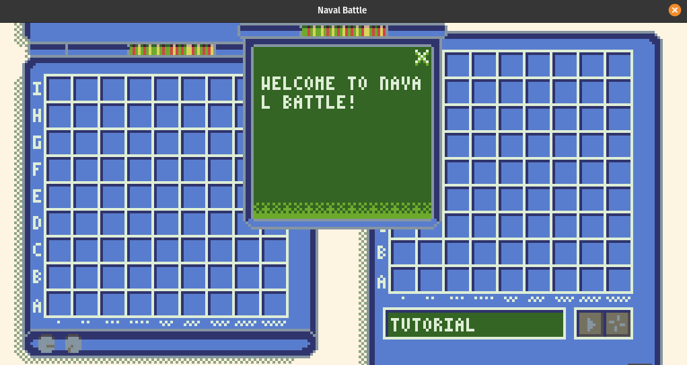
The tutorial mostly consists of these "modals" or "popups" you could say, which
display the tutorial messages to the player. They can skip these by clicking 
left or right mouse buttons.

Screenshot of the fleet placement screen:
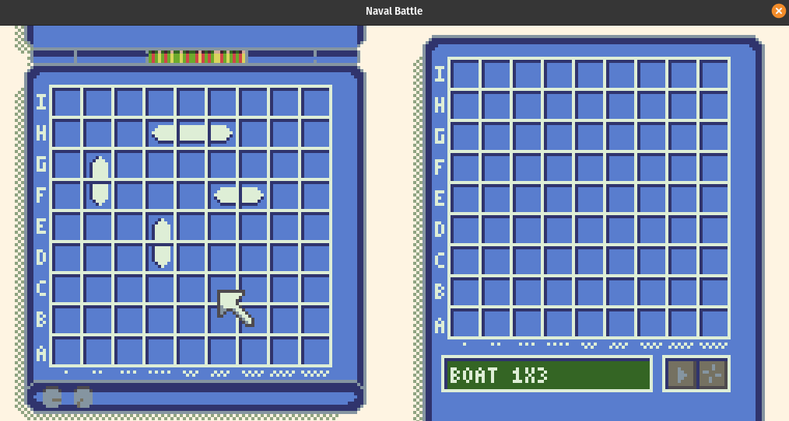
In the fleet placement screen, the user places their boats on the left board.
The boat the user is going to place next is displayed on the bottom right in 
the tiny little 16 character LCD-make-believe display. The user can also 
rotate their boat before they place with the right mouse button.

Screenshot of the first turn:
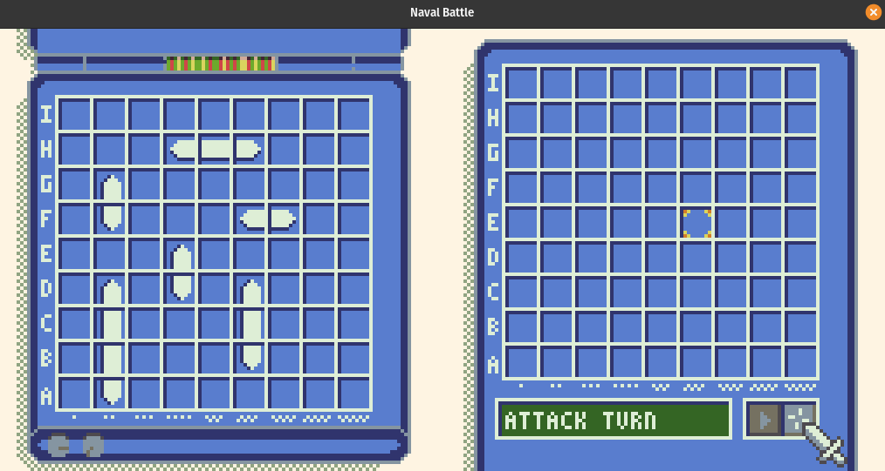
To attack, the user must select a tile on the grid with the spot they want to
attack. Then they must press the crosshair button to confirm their attack. This
will give the result of the attack with a White X (meaning miss) or a Red X 
(meaning hit).

Screeshot in the middle of a match against the computer:
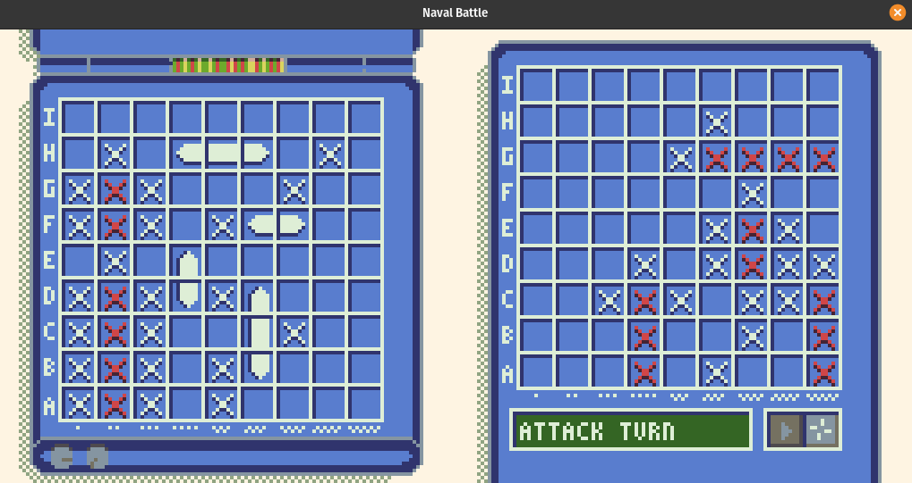
Having both your fleet board and your guess board next to eachother really 
makes it easy to understand your current position in the game at a glance.

Screeshot of a Computer win:
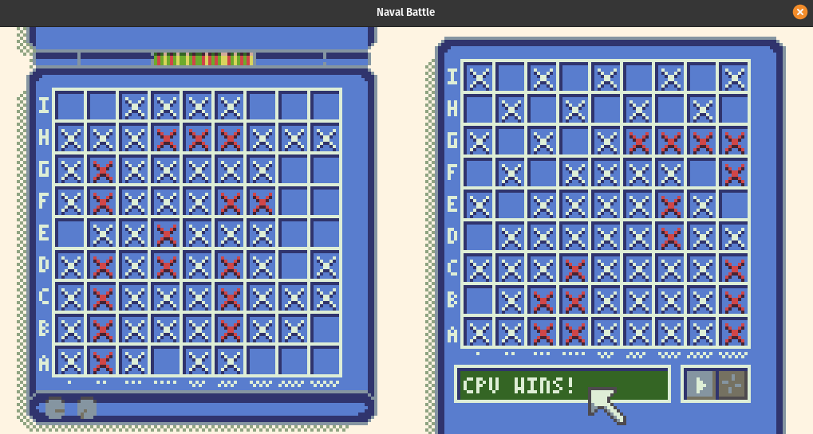
When either player wins, the message displayed in the mini LCD-make-belive 
display will either say "CPU Wins!" or "CPU Lost!" emphatising that the 
computer is the protagonist of the story.

# 8. Testing

At the start testing was an important process of making the ECS system work 
since most of the methods were happening where you couldn't see i.e. the 
**EntityManager** and the **ComponentRegister** so to find out if these were
indeed working properly a **ECSTest** class was created with a `main` method to
run standard usecases like adding a new **Entity**, registering new 
**Component**s, filtering Entities, crosschecking **Entity** genomes, creating
components.
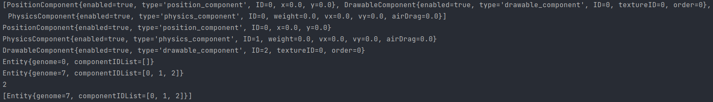
> This is more understandable if you understood read the code

This class became runnable into a small test window with a simple physics 
system and a debug system. If the user presses the space bar button on their
keyboard an entity will be created on the mouse position that will bounce and 
fall out of the window as if it was affected by gravity from the physics 
system. Looks something like this when ran:
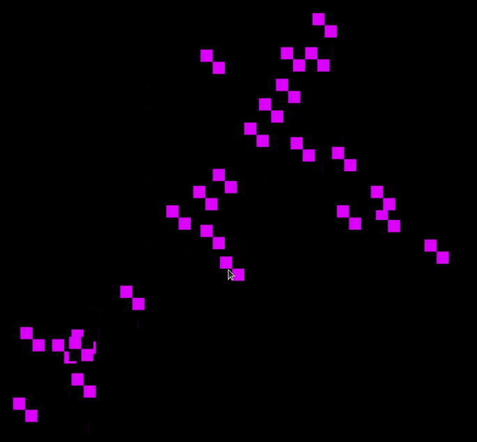

Testing of the actual game was however a little more undocumented. The more I
programmed the more I tested it myself since it was just a game but I asked 
other students to test my game for me.

A couple of bugs were eventually found. Putting your fleet close together made 
the computer guess the same position again and again. You could also guess the 
same position for a couple of updates. The program would hang if the computer 
thought you put your boat outside the edges of the grid. It would also hang if
both of you won (this bug was later turned into a feature with the Tie game 
over). But most of these bugs were ironed out with a couple of hours of playing
the game over and over again.

# 9. Conclusion

Although this is not exactly what I learnt in the classroom (or pptx if we are
going to be honest), this is much more liberating to create instead of using 
the regular Swing/AWT and achieve nothing academically.

The learning potential from software-rendering, creating my ECS, optimizing 
code and even bit manipulating, really emphatized each and every aspect of what
I learnt these past 4 years (besides networking hehe) and I am glad you could
share the bus with me on this adventure.

The code is accessible on GitHub on this link: 
https://github.com/onelikeandidie/BattleShipGame and there is 1 downloadable 
release (maybe more if you're lucky).

# 10. References

- Majoolwip, _Java Game Engine Youtube Playlist_. Available at: https://www.youtube.com/watch?v=&list=PL7dwpoQd3a8j6C9p5LqHzYFSkii6iWPZF
- A. Kramarzewski, E. De Nucci, _Practical Game Design_. ISBN:9781787121799. Available online at: https://www.packtpub.com/product/practical-game-design/9781787121799
- F. Ghayour , D. Cantor, _Real-Time 3D Graphics with WebGL 2_. ISBN:9781788629690. Available online at: https://www.packtpub.com/product/real-time-3d-graphics-with-webgl-2-second-edition/9781788629690
- B. Payne, _Learn Java the Easy Way_. ISBN-13:978-1-59327-805-2. Available online at: https://nostarch.com/learnjava
- P. Laken, _Beating Battleships with Algorithms and AI_. Available online at: https://paulvanderlaken.com/2019/01/21/beating-battleships-with-algorithms-and-ai/

# 11. Thanks

Thank you to Jetbrains for making the only IDE that doesn't make me want to 
blow my brains out when working with Java.

Thank you to yFiles for generating the Diagrams, even if it was from IntelliJ
IDEA.

Thanks to Majoolwip for making such an informing series of videos on how to 
work with Java as a software renderer. Even if the ideas you implemented after
were not that good considering the performance of Java 8.

Thank you to you the reader for going on this journey with me. Java can be 
terrifying with its old decrepid JVM :).

Thank you to my parents, who kept me afloat during my `Student Life`

Thank you to my partner, who kept me from not kermiting sewer slide from 
working on this.

# 12. Appendix

**FULL UML DIAGRAM WITH ALL THE CLASSES AND METHODS** 
***(THIS WILL HURT, I WARNED YOU)***

